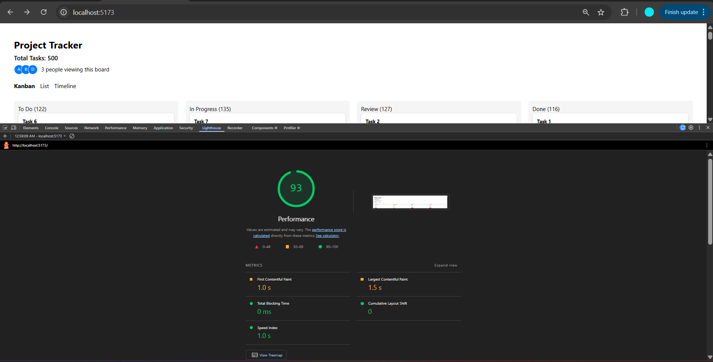

# Multi-View Project Tracker UI

A frontend task management application built using **React + TypeScript** that allows users to manage tasks across multiple views while maintaining a shared dataset.

The project demonstrates custom UI architecture, performance optimization, and complex frontend interactions without using any external UI, drag-and-drop, or virtualization libraries.

---

# Live Demo

https://multi-view-project-tracker-amber.vercel.app

---

# Features

The application supports three major views:

• **Kanban Board**  
• **Virtualized List View**  
• **Timeline / Gantt View**  
• **Live collaboration indicators**

The interface allows users to visualize and update task progress through different perspectives while keeping the dataset synchronized across all views.

---

# Tech Stack

## Framework
- React
- TypeScript
- Vite

## State Management
- Zustand

## Styling
- Custom CSS components (no UI libraries used)

## Other Techniques
- Native HTML5 Drag and Drop
- Custom Virtual Scrolling
- URL Query State Management

---

# Technical Requirements Compliance

| Requirement | Implementation |
|-------------|---------------|
| React with TypeScript | Implemented using Vite + React + TypeScript |
| No UI component libraries | All UI elements built using custom components |
| No drag-and-drop libraries | Implemented using native HTML5 drag events |
| No virtual scrolling libraries | Custom virtual scrolling implemented |
| State management | Zustand |
| Responsive layout | Desktop (1280px+) and tablet (768px) supported |
| Seed data | 500 randomized tasks generated |
| Performance | Lighthouse score ≥ 85 |

---

# Application Views

## 1. Kanban Board

The Kanban board organizes tasks into four columns:

- To Do
- In Progress
- Review
- Done

### Features

- Drag and drop cards between columns
- Drop zone highlighting
- Visual drag feedback (opacity + shadow)
- Placeholder space while dragging
- Instant task status updates

Each task card displays:

- Title
- Assignee
- Priority badge
- Due date
- Overdue indicator

---

## 2. List View

The List View displays all tasks in a table format.

### Features

- Sorting by Title
- Sorting by Priority
- Sorting by Due Date
- Inline status editing
- Virtual scrolling for large datasets

Only the visible rows are rendered to keep performance smooth with large datasets.

---

## 3. Timeline View

The timeline visualizes tasks across the current month.

### Features

- Tasks displayed as horizontal bars
- Bars colored by priority
- Tasks without start date appear on due date
- Vertical marker for today's date
- Horizontal scrolling support

---

# State Management Decision

The application uses **Zustand** for global state management.

Zustand was chosen because it provides a lightweight and simple API compared to more complex solutions like Redux. It enables centralized management of task data while avoiding unnecessary boilerplate.

Since the application contains multiple views (Kanban, List, and Timeline) that rely on the same dataset, a global store ensures that updates made in one view are immediately reflected across the others.

For example, when a task is dragged to a new column in the Kanban board, the status change is stored in Zustand and automatically reflected in the List and Timeline views.

This approach keeps the architecture simple while maintaining consistent application state.

---

# Virtual Scrolling Implementation

The List View implements a **custom virtual scrolling system** to efficiently render large datasets.

Instead of rendering all tasks simultaneously, the application calculates which rows are currently visible in the viewport using the scroll position.

Three constants control the system:

- `ROW_HEIGHT`
- `BUFFER`
- `VIEWPORT_HEIGHT`

Based on the scroll position, the system computes a **start index and end index** of visible tasks. Only those rows are rendered in the DOM.

Each visible row is positioned using **absolute positioning** inside a container whose height represents the total dataset height.

This technique preserves correct scrollbar behavior while drastically reducing DOM nodes and improving performance.

---

# Drag-and-Drop Implementation

The Kanban board uses the **native HTML5 Drag and Drop API**.

Each task card is marked as draggable and uses the following events:

- `dragstart`
- `dragover`
- `drop`
- `dragend`

When a card is dragged:

- Visual feedback appears using opacity and shadow
- Valid drop zones highlight
- A placeholder space is preserved to prevent layout shifts

After the drop event, the task status is updated through the **Zustand store**, ensuring that all views remain synchronized.

---

# Seed Data

The project includes a **data generator that produces 500 tasks**.

Each task contains:

- Title
- Assignee (from a pool of 6 users)
- Priority
- Status
- Start date
- Due date

The generator also includes:

- Overdue tasks
- Tasks with missing start dates

This ensures edge cases are properly tested.

---

# Lighthouse Performance

The application was tested using **Chrome Lighthouse**.

Performance Score:

**93**

Screenshots:

 
 
 
